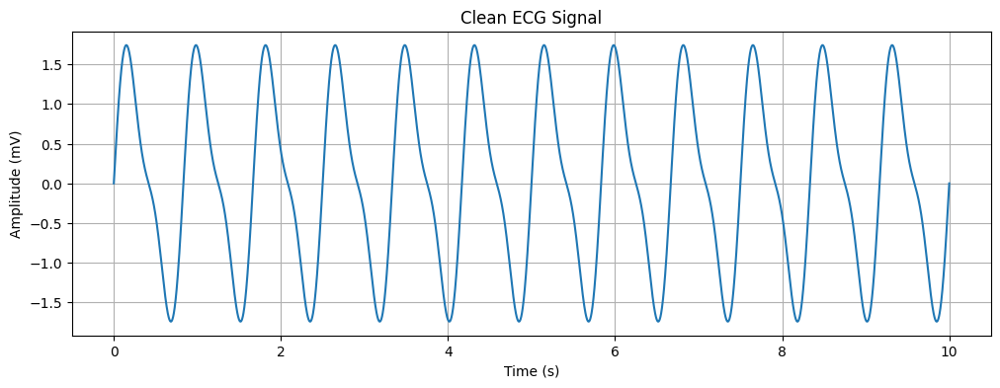
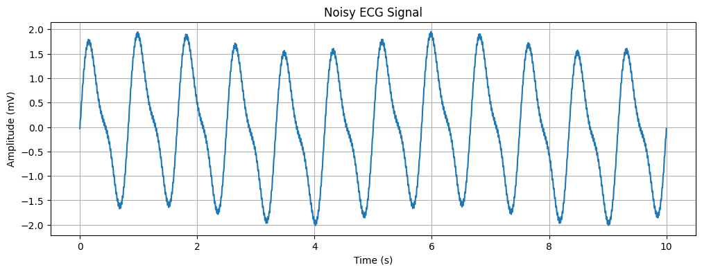
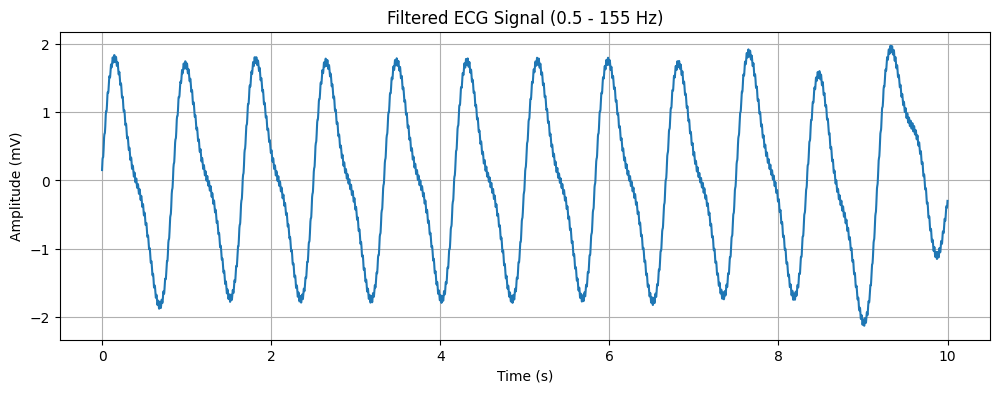

# 🧪 HeartSim Lab: Create, Corrupt & Clean Your Own ECG Signal

**HeartSim Lab** is a simulation-based project where you generate your own synthetic heartbeat signal, add different types of real-world noise, and then clean it back up using signal processing techniques. It’s a great introduction to biomedical signal processing — without needing any actual ECG data!

---

## 🔍 What You’ll Learn

- 🎛 How to simulate a basic ECG waveform using sine waves  
- 🔌 How to model real-life noise:
  - Motion artifact (like when a person moves)
  - Powerline interference (from electrical systems)
  - Flicker noise (random low-frequency noise)  
- 🧼 How to clean the signal using a bandpass filter  
- 📈 How to visualize the clean vs noisy vs filtered signals  

---

## 📁 Notebook Included

### `PROJECT_SIMULATION_HEART_BEAT_M1.ipynb`
- Generates a synthetic ECG signal  
- Adds realistic types of noise  
- Cleans the noisy signal using a digital filter  
- Plots and compares each stage for easy understanding  

---

## 🎯 Who Is This For?

- Students learning biomedical signal basics  
- Data science or ML folks exploring signal preprocessing  
- Anyone who wants to understand ECG signal anatomy  

---

## ⚙️ Requirements

This project runs with Python and just a few common libraries:
- Python 3.8+
- NumPy  
- SciPy  
- Matplotlib  

Install them via pip or conda — no extra tools needed.

---

## 🔬 What It Looks Like
- Synthetic ECG Signal: 💡 
 
- Noisy ECG Signal: 🌪  

- Filtered ECG Signal: 🧼✨ 
 

---

## 🗂 Project Structure

```text
📁 HeartSim-Lab/
├── PROJECT_SIMULATION_HEART_BEAT_M1.ipynb
├── README.md

🧠 Why Use Simulation?
No real data needed

Easy to understand how ECG works

Great for testing filtering, amplification, and noise-handling techniques

You’re in full control of the heart signal 🫀

📜 License
MIT License — feel free to use, remix, and learn from it.

Simulated with science and heart ❤️ by EUGENE OPPONG OKYERE